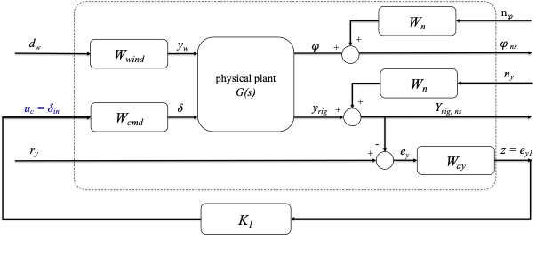
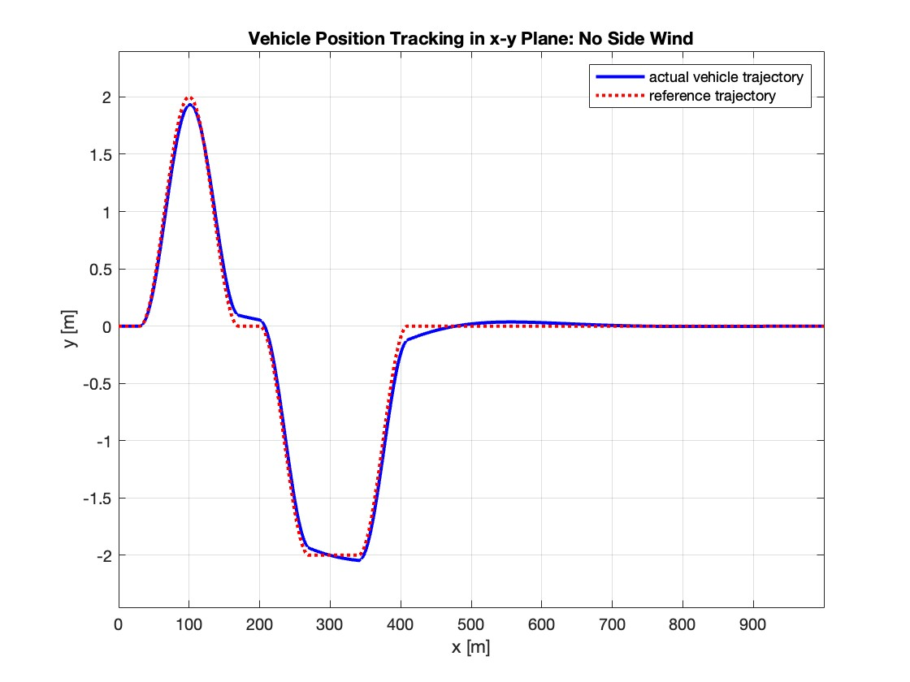
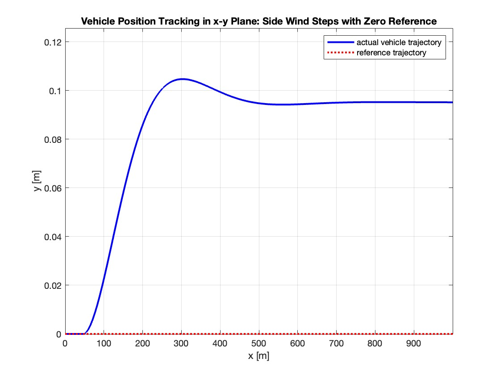
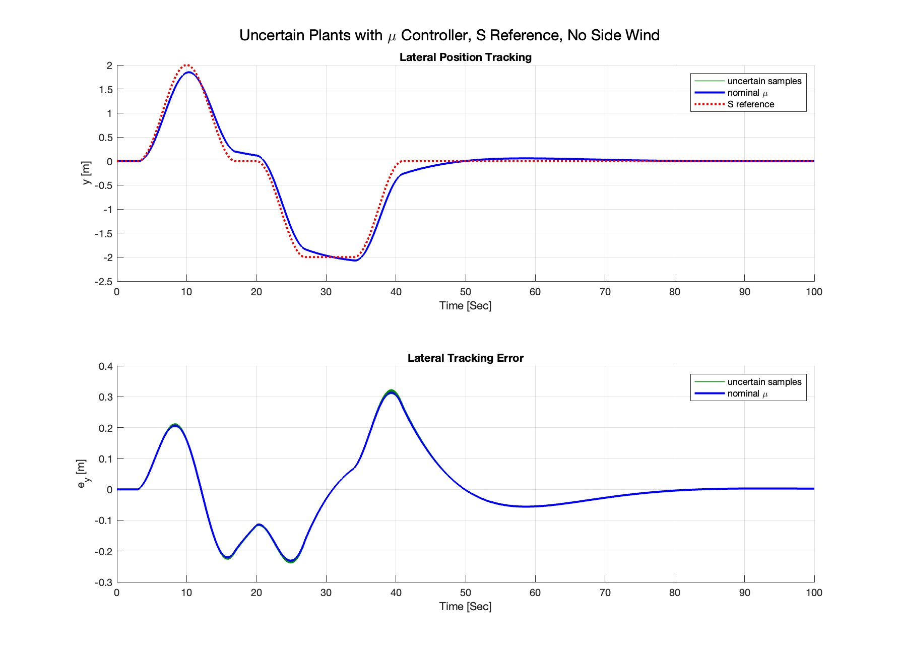

# Vehicle Motion Control Using H-Infinity and Mu Synthesis

This project designs and evaluates a robust lateral steering controller for a
constant-speed vehicle using a linear bicycle model. The controller is developed
in MATLAB with H-infinity synthesis and then checked against physical parameter
uncertainty using robust stability, robust performance, sampled simulations, and
mu synthesis.

The main MATLAB script is `controller.m`. It builds the lateral plant, designs
the nominal H-infinity controller, tests the controller on uncertain plants, and
then runs `musyn` to synthesize a structured robust controller.

## Design Structure

The generalized plant separates the physical vehicle model, weighting filters,
disturbance input, measurement noise, and controller interconnection. The
controller receives the measured lateral tracking error and returns a normalized
steering command.



The synthesis plant includes:

- physical lateral plant `G(s)`
- lateral tracking weight `W_a_y`
- steering command weight `W_cmd`
- side-wind disturbance weight `W_wind`
- measurement-noise weight `W_n`
- tracking-error feedback to the controller

## What Was Implemented

- Derived a lateral-only bicycle model with states:
  `y_rig`, `yaw`, `vy_cg`, and `yaw_rate`.
- Added a side-wind-speed disturbance by linearizing the aerodynamic lateral
  force around a nonzero wind speed.
- Built a named-signal generalized plant in MATLAB for H-infinity synthesis.
- Designed a nominal H-infinity controller using `hinfsyn`.
- Built an unweighted physical closed-loop model for trajectory simulation.
- Added uncertain mass and tire cornering stiffness using `ureal`.
- Evaluated robust stability and robust performance using MATLAB robust-control
  analysis commands.
- Designed a mu-synthesis controller using `musyn` and D-K iteration.
- Compared nominal and sampled uncertain closed-loop trajectory tracking.

## Requirements

This project uses MATLAB with:

- Control System Toolbox
- Robust Control Toolbox

Important Robust Control Toolbox commands used in the workflow include:

- `hinfsyn`
- `ureal`
- `usample`
- `robstab`
- `robgain`
- `musyn`

## Results

### Nominal S-Reference Tracking

The nominal H-infinity controller tracks the S-shaped lateral reference without
side wind. The x-y trajectory confirms that the vehicle follows the desired
lane-change shape.



### Side-Wind Disturbance Rejection

The closed-loop response was also tested with a side-wind step and zero lateral
reference. This test checks how much lateral displacement the controller allows
under a wind disturbance.



### Mu-Synthesis Robust Tracking

After the nominal H-infinity controller failed to certify the full uncertainty
set, a mu-synthesis controller was designed using `musyn`. The sampled uncertain
closed-loop plants were then simulated on the same S-shaped reference with zero
side wind.



## Key Numerical Results

From the MATLAB run recorded in `command_results.txt`:

- H-infinity synthesis gamma: `0.4641`
- Nominal-controller robust stability margin: `[0.2129, 0.2133]`
- Nominal-controller robust performance margin for gamma = 1:
  `[0.1320, 0.1323]`
- Best mu-synthesis robust performance: about `1.03`
- Final `musyn` robust performance: `1.0258`

The nominal H-infinity controller satisfies the nominal weighted tracking
objective, but it is not robustly certified over the full uncertainty set. The
mu-synthesis controller improves the robust-performance result significantly,
but the final value is still slightly above one, so the full modeled uncertainty
set is still not completely certified.

## Files

- `controller.m`: main H-infinity and mu-synthesis design script
- `plotTrackingSimulation.m`: reusable trajectory simulation and plotting helper
- `lateral_abcd.m`: simplified lateral dynamics helper
- `command_results.txt`: MATLAB command-window output from the main run
- `img/`: exported figures used in the report and README
- `report/`: LaTeX source and compiled project report
- `README_lateral_dynamics.md`: detailed lateral model derivation

## Running the Project

Open MATLAB in this directory and run:

```matlab
controller
```

The script will generate the plant analysis, H-infinity controller, uncertainty
analysis, sampled trajectory plots, and mu-synthesis controller results.
